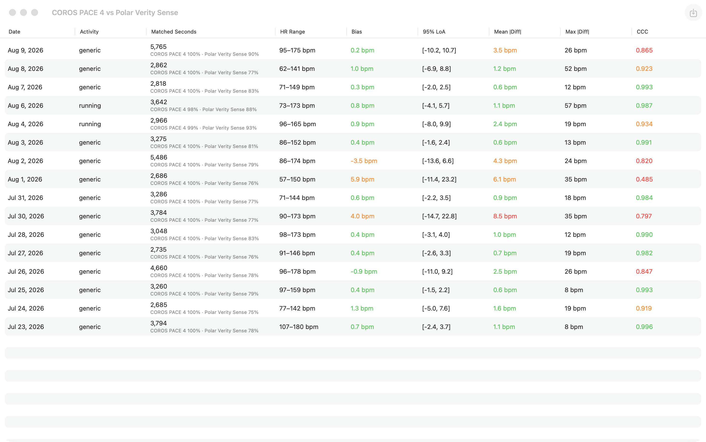
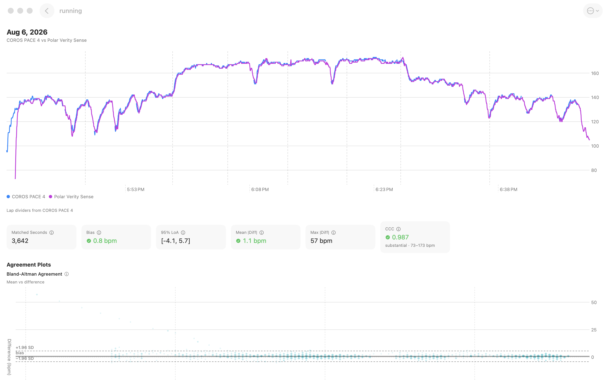
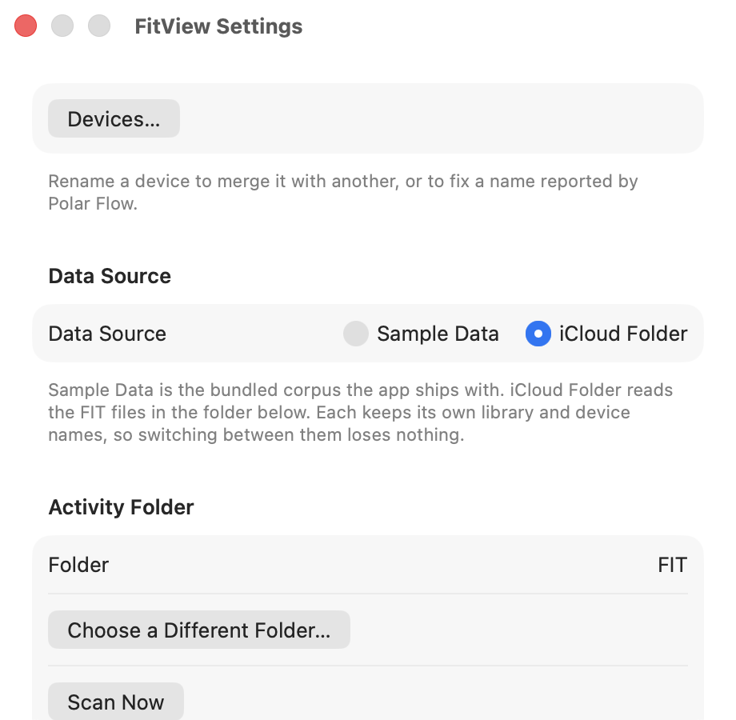
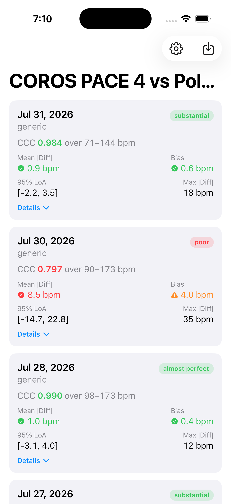
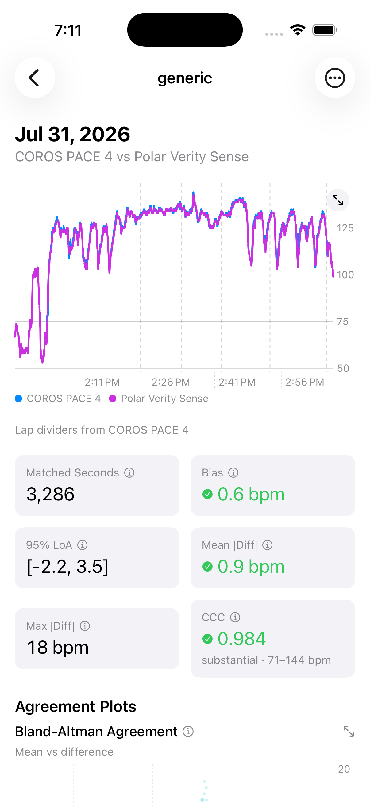

# FitView

**Do your two heart-rate monitors actually agree?**

FitView is a native macOS, iPhone, and iPad app that answers exactly that question. Record the
same workout on two devices at once — say a watch with a wrist optical sensor and a chest
strap — drop both `.fit` files in, and FitView lines the recordings up second by second and
tells you how closely they matched.

Everything happens on your device. There is no account, no server, and nothing is uploaded.



---

## Why this exists

Fitness apps show you *a* heart rate. They don't tell you whether to believe it. Wrist optical
sensors drop out on cold days, ride up your arm, and lag behind sudden efforts; chest straps
lose contact when they dry out. If you own two of them, the honest way to find out which one
you can trust is to wear both and compare.

That comparison is fiddly to do by hand. The two devices never start at the same instant, one
pauses when you stop at a crossing, the other keeps recording while you're stretching in the
car park, and neither shares a clock. FitView handles all of that and reduces each session to
a handful of numbers you can scan down a list.

---

## Features

**Compare a whole training block, not just one run**

- Every session in your library on one screen, one row per workout, with the agreement numbers
  side by side — so you can see whether a bad day was a fluke or the start of a pattern.
- Good / borderline / poor results are colour-coded, so a problem session catches your eye
  without you reading a single number.
- Tap or click any row to drill into that one workout.

**Statistics that actually describe agreement**

- **Mean and max absolute difference** — the headline "how many beats apart were they" number.
- **Bland-Altman agreement** — bias (is one device consistently reading high?) plus 95% limits
  of agreement (how wide is the spread?), which a correlation alone can't tell you.
- **Lin's concordance correlation coefficient (CCC)** — folds accuracy and precision into a
  single score, described in plain words using McBride's benchmarks: *almost perfect*,
  *substantial*, *moderate*, *poor*.
- Every metric has an **ⓘ button** that explains what it means and how to read it.
- Heart-rate range is always shown next to the CCC, because a CCC over a narrow range and one
  over a wide range aren't comparable at face value.

**Charts**

- Both devices' heart rate overlaid on one timeline, with lap dividers from whichever device
  recorded them.
- A Bland-Altman plot and a concordance scatter plot, with overlapping points shaded by
  density so a cloud of thousands of samples stays readable.
- Full-screen chart mode on iPhone for a closer look.

**Honest about gaps**

- Alignment is a strict same-second match, and FitView tells you what that cost: per-device
  **coverage** (how much of what each device recorded found a partner) and each device's own
  recording span, so auto-pause gaps are visible rather than mysterious.
- A reading of 0 bpm is treated as a dropout, not a measurement — sensors report 0 when they
  lose skin contact, and averaging that in would be nonsense.
- Sessions that can't be compared (no overlap, missing a device, too few points) are **listed
  with the reason**, never silently dropped.

**Getting your files in, several ways**

- **A watched folder** — point FitView at a folder (ideally in iCloud Drive), and it picks up
  new files on launch and whenever you come back to the app. Delete a file from the folder and
  the matching activity disappears here too.
- **The share sheet** — send a `.fit` file to FitView from Files, Mail, or any other app, on
  both iPhone and Mac.
- **Drag and drop** onto the window on macOS.
- **The Files picker** on any platform.
- **Polar Flow sync** — connect a Polar account and new activities download automatically.
  (Needs a Polar developer client ID; see [Optional: Polar Flow](#optional-polar-flow-sync).)
- **Eight bundled sample workouts** (16 files, two devices each), so the app is useful the
  moment you open it, before you've imported anything of your own. Sample data and your real
  data live in separate libraries and can never mix.

**Native, everywhere**

- One app for macOS, iPhone, and iPad. The Mac and iPad get a wide table; the iPhone
  gets a card layout built for the narrower screen, not a squeezed-down table.
- Rename a device to merge two names that are really the same sensor, or to fix an unhelpful
  name reported by Polar Flow.
- Delete an activity you don't want cluttering the comparison.
- An exportable diagnostic log, for when a sync doesn't do what you expected.

---

## Screenshots

### Mac

The session list. One row per workout, colour-coded by how well the two devices agreed.


A single session: both devices overlaid, the agreement metrics, and the Bland-Altman plot
underneath.



Settings, where you choose between the bundled samples and your own folder of files.



### iPhone

| Session list | Session detail |
| --- | --- |
|  |  |

---

## How to read the numbers

| Metric | Looks good | Borderline | Worth investigating |
| --- | --- | --- | --- |
| Mean absolute difference | ≤ 3 bpm | 3–7 bpm | > 7 bpm |
| CCC | ≥ 0.95 | 0.90–0.95 | < 0.90 |

**Bias** is the average signed difference. A bias near zero with a wide 95% LoA means the two
devices agree on average but disagree moment to moment. A large bias means one device is
consistently reading higher than the other.

**Coverage below 100% is normal**, not a bug. A chest strap that starts recording ten minutes
before you press go on your watch will typically show 75–85% coverage — those extra minutes had
nothing to be compared against. What matters is that both devices covered the same workout;
coverage tells you how much of each recording was usable for the comparison.

---

## Naming your files

FitView groups files into sessions using their filenames — there's no hidden database, so what
you name a file is what you get.

```
2026-07-26_pace4_run.fit
└── date ──┘ └dev┘ └act┘
```

- **Date** first, as `YYYY-MM-DD`.
- **Device name** next. This is what groups two files into one comparison, so use the same name
  every time for the same sensor.
- **Activity** last, and optional — `2026-07-26_pace4.fit` works fine.

A hyphen instead of the underscore after the date is accepted (`2026-07-26-pace4_run.fit`), the
`.fit` extension can be upper or lower case, and multi-word activities (`long_run`) stay intact.
Anything FitView can't parse is reported to you by name rather than quietly ignored.

One catch: the device is always the first chunk before an underscore, so
`2026-07-26_my_device_run.fit` reads as device `my`, activity `device_run`. Avoid underscores
inside device names.

---

## Installing FitView

FitView isn't on the App Store. To use it you build it yourself, once, on a Mac. You don't need
to know how to program — the steps below are the whole thing, and you can copy and paste every
command.

### What you need

- **A Mac running macOS 14 (Sonoma) or later.** This is required even if you only want the app
  on your iPhone — iPhone apps are built on a Mac.
- **An Apple ID.** The free one you already use is fine; you don't need a paid developer
  account.
- **About 45 minutes**, most of it waiting for Xcode to download.
- For the iPhone version: **an iPhone running iOS 17 or later**, and its cable.

### Step 1 — Install Xcode

Xcode is Apple's free app for building apps.

1. Open the **App Store** on your Mac.
2. Search for **Xcode** and install it. It's a large download (several gigabytes) and will take
   a while.
3. Open Xcode once when it finishes. Agree to the licence, and let it install any extra
   components it asks for. Then quit it.

### Step 2 — Download FitView's code

1. Go to the project page on GitHub: <https://github.com/collin-braeuning/fit-view>
2. Click the green **Code** button, then **Download ZIP**.
3. Find the downloaded ZIP in your **Downloads** folder and double-click it to unzip.
4. You'll get a folder called `fit-view-main`. Drag it somewhere you'll remember — your
   **Documents** folder is a good choice.

### Step 3 — Install the two build tools

FitView's Xcode project is generated from a configuration file rather than checked in, so you
need one small tool to create it. This is the only part that uses the Terminal.

1. Open **Terminal** (press ⌘ Space, type `Terminal`, press Return).
2. Copy and paste this line, then press Return. It installs **Homebrew**, the standard way to
   install command-line tools on a Mac:

   ```sh
   /bin/bash -c "$(curl -fsSL https://raw.githubusercontent.com/Homebrew/install/HEAD/install.sh)"
   ```

   It will ask for your Mac password. Type it — the letters won't appear as you type, which is
   normal — and press Return. When it finishes, it may print two extra commands starting with
   `echo` and ask you to run them. Copy, paste, and run those too.

3. Now install **XcodeGen**:

   ```sh
   brew install xcodegen
   ```

### Step 4 — Generate the Xcode project

Still in Terminal, type `cd ` (with a space after it), then **drag the `fit-view-main` folder
from Finder onto the Terminal window** — this fills in the path for you — and press Return.

Then run:

```sh
xcodegen generate
```

You should see `Created project at .../FitView.xcodeproj`.

### Step 5 — Open the project and set your Apple ID

1. In Finder, open the `fit-view-main` folder and double-click **`FitView.xcodeproj`**. Xcode
   will open, and may spend a minute downloading a component it needs.
2. In Xcode's menu bar, go to **Xcode → Settings → Accounts**, click **+**, choose **Apple ID**,
   and sign in. Close Settings.
3. In the left sidebar, click the blue **FitView** icon at the very top.
4. In the main area, select the **FitView-macOS** target from the list, then click the
   **Signing & Capabilities** tab.
5. Set **Team** to your own name (it'll appear as something like *Your Name (Personal Team)*).
6. Do the same for the **FitView-iOS**, **FitViewShareExtension-macOS**, and
   **FitViewShareExtension-iOS** targets.

If Xcode complains that a bundle identifier is already taken, change `com.fitview` to something
unique to you — for example `com.yourname.fitview` — in the **Bundle Identifier** box of each
target, keeping the rest of each identifier the same.

### Step 6 — Run it on your Mac

1. At the top of the Xcode window there's a dropdown showing a scheme name. Set it to
   **FitView-macOS**.
2. Press the **▶ Play** button (or ⌘R).
3. The first build takes a few minutes. FitView will then open, already showing the bundled
   sample workouts.

The app you just built lives in a temporary build folder. To keep it: in Xcode's left sidebar,
open **Products**, right-click **FitView.app**, choose **Show in Finder**, and drag it to your
**Applications** folder.

### Step 7 — Run it on your iPhone (optional)

1. Plug your iPhone into your Mac and unlock it. Tap **Trust** if asked.
2. In Xcode, change the scheme dropdown to **FitView-iOS**, and pick your iPhone from the device
   list next to it.
3. Press **▶ Play**.
4. The first time, your iPhone will refuse to open the app. On the phone, go to **Settings →
   General → VPN & Device Management**, tap your Apple ID, and tap **Trust**. Then open FitView
   from your home screen.

With a free Apple ID, apps installed this way stop working after **seven days**. Plug the phone
back in and press Play again to renew it. A paid Apple Developer account ($99/year) extends
this to a year.

### Step 8 — Point it at your own workouts

1. Put your `.fit` files in a folder, named as described in [Naming your
   files](#naming-your-files). A folder inside **iCloud Drive** works well, because then your
   Mac, iPhone, and iPad all see the same files.
2. In FitView, open **Settings** (⌘, on Mac, or the gear icon on iPhone).
3. Under **Activity Folder**, click **Choose Folder…** and select it.
4. Switch **Data Source** to **iCloud Folder**.

FitView rescans that folder every time you launch or return to the app. Your sample data stays
in its own separate library, so you can switch back and forth without losing anything.

### If something goes wrong

- **"Command not found: xcodegen"** — Homebrew installed but isn't on your path yet. Quit and
  reopen Terminal, then try again.
- **"Signing for ... requires a development team"** — a target was missed in Step 5. Go back and
  check all four.
- **Xcode shows red errors immediately after opening** — it's usually still downloading the FIT
  parsing library. Wait for the activity indicator at the top to finish, then build again.
- **The app opens but shows no sessions** — in the folder mode, check your filenames match the
  pattern in [Naming your files](#naming-your-files). Settings reports how many files it found
  and names any it couldn't import.

### Optional: Polar Flow sync

Downloading activities straight from Polar Flow needs your own API credentials, because Polar
issues them per developer.

1. Register a client at <https://admin.polaraccesslink.com>.
2. Copy `Secrets.xcconfig.template` to `Secrets.xcconfig` in the project folder and fill in your
   client ID and secret. That file is untracked by git, so it won't be committed.
3. Rebuild. **Settings → Polar Flow → Connect** will then be available.

Without this, the Polar section simply reports that it isn't configured; everything else works
normally. Note that Polar only shares activities recorded *after* you connect, and only from the
last 30 days.

---

## Known limitations

- **Heart rate only.** Pace, cadence, power, and altitude are read from the files but not
  compared.
- **Two devices at a time.** Bland-Altman and CCC are inherently pairwise.
- **Strict same-second matching.** There's no clock-offset or drift correction, so a device
  whose clock is off by more than half a second will lose samples. The coverage numbers are
  there so you can see when that's happening.
- **First activity per file.** A multisport file contributes one session.

---

## For developers

The domain layer — FIT decoding, timeline alignment, statistics, filename parsing, batch
aggregation — lives in the `FitViewCore` Swift package and is free of SwiftUI, so it's testable
without a UI. `overview.md` is the full domain reference: data model, alignment rules, exact
statistical definitions, and the pinned acceptance numbers the port was validated against. Read
it before changing anything in `Packages/FitViewCore`.

```sh
xcodegen generate                              # after editing project.yml or adding files
cd Packages/FitViewCore && swift test          # domain tests
xcodebuild test -scheme FitView-macOS \
  -only-testing:FitViewTests -destination 'platform=macOS'
```

The Xcode project is generated from `project.yml` (XcodeGen) and is not checked in — edit
`project.yml`, not the `.xcodeproj`. Feature specifications live in `specs/`.

### CI

`.github/workflows/tests.yml` runs the `FitViewCore` unit tests and the `FitViewTests` bundle on
every pull request and every push to `main`.
